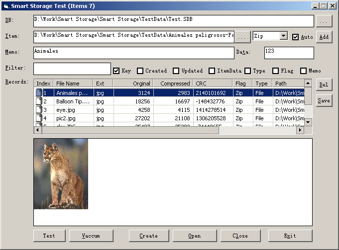



## Smart Storage with 2 compressions\(zip/huffman\) \#update 4

### Description

Smart Storage with 2 compressions(zip/huffman)

Smart Storage is something like a file packager, you can add any file(s) of any format to the storage file(AddUpdateItem function) and remove them(DeleteItem function), of course. It uses index(file) technique for a better performance, thus it has VaccumStorage() function. And this project is originally aimed to be the storage part of Carles P.V's Thumbnailer 1.0 (image thumbnailer-viewer with GDI+)(http://www.Planet-Source-Code.com/vb/scripts/ShowCode.asp?txtCodeId=59677&lngWId=1), thus it includes the PictureFromByteStream() function to directly return a picture object from a byte array! Beside that, there are: GetItemText() function for direct return of plain text content; GetItemPicture() function for direct return of picture object according to the index; SaveItemToFile() function to save the content to disk file according to the index.

Some of the codes are not written by me, such as cHuffman, cCRC. They are from psc, now they are back for you guys:)

The zlib dll is generated at runtime of sample test since psc will remove all PE file. It is easy for you to remove the zlib dependancy, that's why I only enclosed it in the sample project.

And I make all these functions into a class for handy usage. I also use Copymemory for a better performance. Please feel free to leave any comments, bugs or suggestions are welcome!

Usage:

1.Simply open the sample storage, then click listed files, content displayed, doubleclick to save.

2.Select DB File->Create->Open->Select Item File, add it...

Sorry for lack of code comments, but I think that the method is really simple.

#update 1: now with compression and better sample, fixed some bugs and improve error handling

#update 2: added huffman compression, CRC, GetItemText()/GetItemPicture() functions, fixed bugs in VaccumStorage.

#update 3: added support for byte array(such as DIBs)/text etc. And ItemData for extract info.

#update 4: added FilterItems() function for quick searcing.

please visit a new version: http://www.planet-source-code.com/vb/scripts/ShowCode.asp?txtCodeId=59797&lngWId=1

with updates:

#update 5: added ReadItemContentChunk(), chunk by chunk to read a file, rather than read the whole file at once. added Version support. Improved OpenStorage result. Now with full DIBs support, from an image to store in storage, then from storage back to be an image!

#update 6: fixed bug in ReadItemContentChunk() due to changed with serialized section chunk.
 
### More Info
 

             |
---                |---
**Submitted On**   |2005-04-02 10:22:06
**By**             |[enmity](https://github.com/Planet-Source-Code/PSCIndex/blob/master/ByAuthor/enmity.md)
**Level**          |Intermediate
**User Rating**    |5.0 (20 globes from 4 users)
**Compatibility**  |VB 4\.0 \(32\-bit\), VB 5\.0, VB 6\.0
**Category**       |[Files/ File Controls/ Input/ Output](https://github.com/Planet-Source-Code/PSCIndex/blob/master/ByCategory/files-file-controls-input-output__1-3.md)
**World**          |[Visual Basic](https://github.com/Planet-Source-Code/PSCIndex/blob/master/ByWorld/visual-basic.md)
**Archive File**   |[Smart\_Stor187103422005\.zip](https://github.com/Planet-Source-Code/enmity-smart-storage-with-2-compressions-zip-huffman-update-4__1-59723/archive/master.zip)

